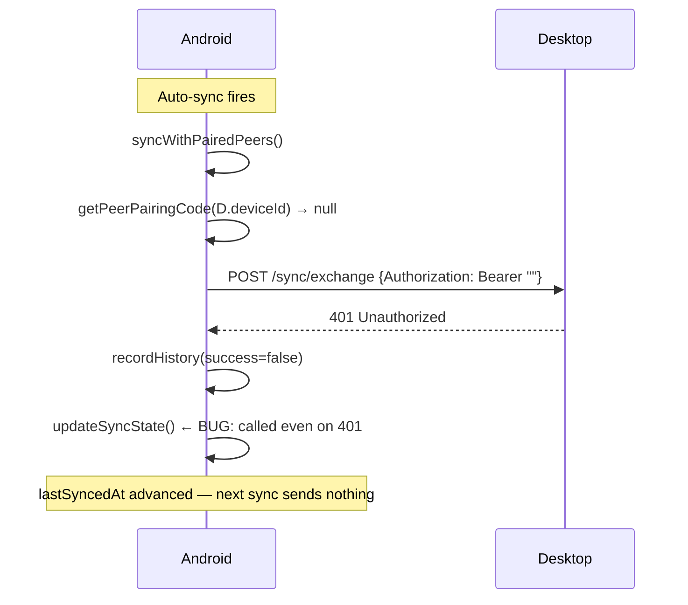

# SYNC EVALUATION SCRATCH — Progressive Device Sync

Evaluated: 2026-04-23  
Author: AI sync architect  
Goal: LocalWiFi → Bluetooth → USB → File → Cloud (each independent, graceful fallback)

---

## TRANSPORT EVALUATION

### T1 — Local WiFi (LAN HTTP + mDNS)

**Android (no root)**
- `dart:io` HttpServer can bind to any port — full local HTTP server in-app
- `nsd` package (pub.dev/packages/nsd) handles mDNS service registration + discovery
- Requires: INTERNET, CHANGE_WIFI_MULTICAST_STATE, ACCESS_WIFI_STATE
- No root needed. Tested on real devices (emulators block mDNS multicast)
- Works on same LAN. Does NOT work across NAT without extra setup.

**Windows Tauri (no admin)**
- Rust: `axum` + `tokio::net::TcpListener` runs a local HTTP server on any port
- `mdns-sd` crate (lib.rs) handles mDNS service registration and discovery
- Windows Firewall may prompt user once when server first listens — acceptable
- `tauri::async_runtime::spawn` runs the server in background without blocking UI

**Minimum viable implementation**
- Desktop becomes HOST: starts axum server on port 47821, registers `_studysync._tcp` via mdns-sd
- Android becomes CLIENT: discovers via nsd, connects, exchanges payload via HTTP POST
- Pairing: 6-digit code shown on host, entered on client — one-time per device pair
- After pairing: sync is automatic on discovery, bidirectional (both push + pull)

**Failure mode**: Not on same LAN → show "No devices found", fall through to BT

---

### T2 — Bluetooth

**Android (no root)**
- `flutter_bluetooth_serial` package (pub.dev) — Bluetooth Classic RFCOMM/SPP
- Requires: BLUETOOTH, BLUETOOTH_ADMIN, BLUETOOTH_CONNECT, BLUETOOTH_SCAN
- Devices must be paired at OS level first (system settings), then app connects
- Data transfer: raw byte stream — send JSON payload framed with length prefix
- NOTE: Bluetooth Classic requires initial OS-level pairing. BLE is possible but
  more complex to implement a reliable data channel for large payloads.

**Windows Tauri (no admin)**
- Windows 10 supports Bluetooth Classic via Win32 Winsock2 API or `btleplug` crate
- `btleplug` (crates.io) supports BLE discovery and GATT on Windows 10 without admin
- For Classic RFCOMM: `windows` crate + socket API — functional but complex
- Practical minimum: use btleplug for BLE advertisement + GATT data channel
- LIMITATION: Windows BLE GATT server (peripheral mode) is not well supported —
  Windows typically acts as central (client). Desktop can discover and initiate,
  but cannot advertise itself as a peripheral well.

**Decision**: Implement Bluetooth as Android-to-Android or Android-initiates-to-desktop.
Desktop cannot reliably act as BT peripheral on Windows without custom driver.
Show honest status in UI: "Bluetooth discovery requires Android to initiate pairing."

**Minimum viable implementation**
- Android scans for bonded devices running StudyTracker (identified by service UUID)
- Android initiates RFCOMM connection, transfers payload
- Desktop receives via background thread on known UUID

**Failure mode**: Bluetooth off or devices not bonded → show "Enable Bluetooth and pair devices in system settings", fall through to USB/File

---

### T3 — USB

**Android (no root)**
- Android does not allow apps to detect USB host/device connection via public API without
  being the USB host or using UsbManager which requires the app to be the USB host side
- MTP (file transfer mode) is controlled by the system, not accessible to apps directly
- ADB-based transfer requires developer mode — not viable for regular users
- REAL option: When in USB file transfer mode, Android exposes internal storage to Windows
  as a drive. App can write a sync file to a known folder (Downloads), user plugs in USB,
  Windows reads the file.

**Windows Tauri (no admin)**  
- Tauri can watch a directory for new files (tauri-plugin-fs or native Rust notify crate)
- When Android is connected in MTP mode, Windows mounts it as a drive letter or portable device
- Rust `notify` crate can watch for new `.studysync` files on the mounted device path

**Decision**: USB is effectively "guided file transfer via USB cable".
- On Android: write sync file to Downloads folder with a well-known name
- On Windows: show a "Watch for USB device" toggle that polls/watches for the file
- This is functionally identical to File Export but with cable guidance in the UI
- MERGE with File transport: show "USB / File" as a single transport section
- The USB option is just "save to Downloads and plug in cable" guidance

**Failure mode**: Always available as long as file system works — no network needed

---

### T4 — File Export/Import (universal fallback)

**Android (no root)**
- `dart:io` File + `path_provider` for temp/downloads directory
- `share_plus` to open Android share sheet (AirDrop equivalent, Drive, email, BT file)
- `file_picker` to import a .studysync file from anywhere
- Encryption: `encrypt` package (AES-256-GCM) with user-chosen passphrase (PBKDF2 key derivation)

**Windows Tauri (no admin)**
- Tauri `dialog.save()` / `dialog.open()` for file picker
- Tauri `fs` plugin for writing/reading files
- Rust `aes-gcm` + `pbkdf2` crates for encryption
- Export to Downloads folder with timestamped filename

**Minimum viable implementation**
- SyncPayload serialized to JSON → AES-256-GCM encrypted with passphrase → written to .studysync file
- Passphrase must match on both devices (user sets it once in sync settings)
- Import reads, decrypts, applies payload idempotently via SyncEngine

**Failure mode**: Always works — completely offline, no hardware required

---

### T5 — Cloud (configurable, optional)

**Options ranked by fit**
1. Supabase (best): free tier (500MB DB, unlimited API calls), open-source, self-hostable,
   configurable URL, REST API works from both Dart (supabase_flutter) and Tauri (reqwest)
2. Firebase: no self-hosting, proprietary, cloud-first (goes against our local-first model)
3. Custom endpoint: user provides any URL accepting our standard JSON payload

**Decision**: Supabase as primary, custom endpoint as secondary. Firebase skipped.
- User enters Supabase URL + anon key (or leaves blank = disabled)
- Background sync: check every 5 minutes when online, or on app focus
- No data leaves device if cloud is disabled

**Failure mode**: No internet → queue locally, retry on reconnect. User sees "Last synced: X".

---

## SYNC PAYLOAD ARCHITECTURE

### Device Identity
- `device_id`: UUID generated once on first install, stored in app_settings as `syncDeviceId`
- `device_name`: User-editable label stored as `syncDeviceName` (default: hostname)

### Payload Schema (JSON)
```json
{
  "payload_version": 1,
  "device_id": "uuid",
  "device_name": "My Desktop",
  "profile_sync_id": "uuid-of-profile",
  "exported_at": "2026-04-23T09:00:00.000Z",
  "since_timestamp": "2026-01-01T00:00:00.000Z",
  "tables": {
    "study_sessions": [ ...rows ],
    "subjects": [ ...rows ],
    "subject_groups": [ ...rows ],
    "session_tasks": [ ...rows ],
    "goals": [ ...rows ],
    "mood_logs": [ ...rows ],
    "profiles": [ ...rows ]
  }
}
```

### Row Identity & Conflict Resolution
- Each row has `sync_id` (UUID, globally unique, set at creation, never changes)
- Conflict rule: **last-write-wins** using `updated_at` UTC timestamp
- If incoming row has the same `sync_id` as a local row:
  - If incoming `updated_at` > local `updated_at` → overwrite local
  - If incoming `updated_at` <= local `updated_at` → keep local (discard incoming)
- If incoming `sync_id` is not found locally → INSERT
- Deletions are NOT synced (too complex for v1). Deleted rows just become orphaned on other devices.

### High-Water Mark
- `sync_state` table in local DB tracks: `peer_device_id`, `last_synced_at`, `transport`
- On pull: query remote for rows with `updated_at > last_synced_at` for this peer
- On push: send all rows with `updated_at > last_synced_at` for this peer
- Full sync = `since_timestamp` = epoch (send everything)

### SyncEngine (transport-agnostic)
```
buildPayload(profileSyncId, sincePeerTimestamp) → SyncPayload
applyPayload(payload) → SyncResult { inserted, updated, skipped, errors }
```

The engine reads from and writes to the local SQLite DB only.
It knows nothing about HTTP, Bluetooth, or files.
Transports call buildPayload → send it → receive response payload → call applyPayload.

---

## LOCAL DB ADDITIONS NEEDED

Migration v6 — sync state tracking:
```sql
CREATE TABLE IF NOT EXISTS sync_state (
  peer_device_id TEXT NOT NULL,
  transport TEXT NOT NULL,
  last_synced_at TEXT,
  last_sync_direction TEXT,
  PRIMARY KEY (peer_device_id, transport)
);

INSERT OR IGNORE INTO app_settings (key, value, updated_at)
  VALUES ('syncDeviceId', lower(hex(randomblob(16))), CURRENT_TIMESTAMP);
INSERT OR IGNORE INTO app_settings (key, value, updated_at)
  VALUES ('syncDeviceName', 'My Device', CURRENT_TIMESTAMP);
INSERT OR IGNORE INTO app_settings (key, value, updated_at)
  VALUES ('syncPassphrase', '', CURRENT_TIMESTAMP);
INSERT OR IGNORE INTO app_settings (key, value, updated_at)
  VALUES ('wifiSyncEnabled', 'true', CURRENT_TIMESTAMP);
INSERT OR IGNORE INTO app_settings (key, value, updated_at)
  VALUES ('cloudSyncEnabled', 'false', CURRENT_TIMESTAMP);
INSERT OR IGNORE INTO app_settings (key, value, updated_at)
  VALUES ('cloudSyncUrl', '', CURRENT_TIMESTAMP);
INSERT OR IGNORE INTO app_settings (key, value, updated_at)
  VALUES ('cloudSyncAnonKey', '', CURRENT_TIMESTAMP);
```

---

## IMPLEMENTATION ORDER

0. SyncEngine core (TS) + migration v6
1. File Export/Import transport (works everywhere, no deps)
2. WiFi LAN transport (axum on Tauri side, HttpServer+nsd on Flutter)
3. Bluetooth transport (Flutter-initiated, optional)
4. Cloud transport (Supabase optional)
5. Sync UI screen (settings tab → Sync)

Bluetooth and USB are merged/simplified. WiFi is highest-value local transport.


========

# Epic: Progressive Cross-Device Sync: Local-First Multi-Transport

---

# T1 — Soft-Delete Migration: add deleted_at to all synced tables

## Context

Currently, deleting a row on one device does not propagate to other devices. The row simply disappears locally but resurrects on the next sync from a peer that still has it. This ticket adds a `deleted_at` column to all seven synced tables and updates every repository `list*` query to filter it out.

**Scope:** Flutter (Drift schema + migration) + Desktop (schema.ts + schema.js migration). Both must be done atomically — a half-migrated state will cause sync to silently skip tombstones.

## What to build

### Flutter — `tables.dart` + `database.dart`

Add a nullable `TextColumn? get deletedAt` to each of the seven Drift table classes in file:study_tracker_flutter/lib/data/db/tables.dart:

- `StudySessions`, `SessionTasks`, `Subjects`, `SubjectGroups`, `Goals`, `MoodLogs`, `Profiles`

Bump `schemaVersion` from `5` to `6` in file:study_tracker_flutter/lib/data/db/database.dart.

Add a `from < 6` migration block that runs `ALTER TABLE <table> ADD COLUMN deleted_at TEXT` for all seven tables.

Run `dart run build_runner build --delete-conflicting-outputs` to regenerate `database.g.dart`.

### Flutter — Repositories

In every repository method that lists or queries rows for display, add `WHERE deleted_at IS NULL` (or the Drift equivalent `.where((t) => t.deletedAt.isNull())`). Affected files:

- file:study_tracker_flutter/lib/data/repositories/session_repository.dart
- file:study_tracker_flutter/lib/data/repositories/subject_repository.dart
- file:study_tracker_flutter/lib/data/repositories/settings_repository.dart (profiles list)

Replace hard `DELETE` statements with soft-delete updates: `SET deleted_at = NOW(), updated_at = NOW()`.

### Flutter — SyncEngine

In `_buildSelectSql` inside file:study_tracker_flutter/lib/core/sync/sync_engine.dart, remove any implicit `deleted_at IS NULL` filter — tombstoned rows **must** be included in the payload so they propagate.

In `_upsertRow`, ensure `deleted_at` is included in the dynamic column list and the `CASE WHEN excluded.updated_at > table.updated_at` update clause.

### Desktop — `schema.ts` + `schema.js`

Add a new migration entry (v4 → v5 or whichever is next) in file:src/core/data/schema.ts that runs `ALTER TABLE <table> ADD COLUMN deleted_at TEXT` for all seven tables. Mirror the exact same SQL in file:src/core/data/schema.js.

### Desktop — Repositories

Add `AND deleted_at IS NULL` to every `SELECT` query in the desktop repositories that feeds UI. The `syncEngine.ts` `selectSql` for each table must **not** include this filter (tombstones must travel).

## Acceptance Criteria

flutter analyze passes with zero errors after build_runner regeneration.cargo check passes (no Rust changes needed for this ticket).Existing data is preserved — migration is additive only, no data loss.Deleting a subject on Android sets deleted_at and updated_at; the subject disappears from the list immediately.After sync, the deleted subject's tombstone appears on the desktop and the subject is hidden from the desktop list.Importing a file that contains a tombstone applies it correctly — the row is hidden, not duplicated.Applying the same tombstone twice produces the same result (idempotent).

## Agentic Loop Prompt

```
TICKET: T1 — Soft-Delete Migration

PRIME DIRECTIVE
Read every file before editing it. Quote the exact line you will change.
Run `flutter analyze` and `cargo check` after every file you touch.
Do not move to the next step until the current step has a passing verification.

STEP 1 — Read tables.dart
File: study_tracker_flutter/lib/data/db/tables.dart
Task: List every table class. Confirm which ones are missing a deletedAt column.
Do not edit yet.

STEP 2 — Add deleted_at to Drift table classes
File: study_tracker_flutter/lib/data/db/tables.dart
For each of: StudySessions, SessionTasks, Subjects, SubjectGroups, Goals, MoodLogs, Profiles
Add: TextColumn? get deletedAt => text().nullable()();
Run: dart run build_runner build --delete-conflicting-outputs
Verify: database.g.dart regenerated without errors.

STEP 3 — Add migration v6 to database.dart
File: study_tracker_flutter/lib/data/db/database.dart
Bump schemaVersion to 6.
Add if (from < 6) block with ALTER TABLE ... ADD COLUMN deleted_at TEXT for all 7 tables.
Verify: flutter analyze passes.

STEP 4 — Update Flutter repositories
Files: session_repository.dart, subject_repository.dart, settings_repository.dart
For every list/watch query: add .where((t) => t.deletedAt.isNull()) or equivalent SQL.
For every delete method: replace DELETE with UPDATE SET deleted_at=NOW(), updated_at=NOW().
Verify: flutter analyze passes.

STEP 5 — Update sync_engine.dart
File: study_tracker_flutter/lib/core/sync/sync_engine.dart
In _buildSelectSql: confirm deleted_at IS NOT NULL rows are NOT filtered out.
In _upsertRow: confirm deleted_at is included in the dynamic column list and the CASE WHEN update clause.
Verify: flutter analyze passes.

STEP 6 — Update desktop schema
Files: src/core/data/schema.ts AND src/core/data/schema.js
Add a new migration version that runs ALTER TABLE ... ADD COLUMN deleted_at TEXT for all 7 tables.
Both files must have identical SQL. Do not edit one without the other.
Verify: cargo check passes (no Rust changes needed).

STEP 7 — Update desktop repositories
Files: all repository files under src/core/data/repositories/
Add AND deleted_at IS NULL to every SELECT that feeds UI.
Do NOT add this filter to the selectSql in syncEngine.ts TABLE_CONFIG entries.
Verify: no TypeScript errors (run npm run check or tsc --noEmit).

SELF-ASSESSMENT
After all steps:
- Does deleting a row hide it from the UI immediately? YES/NO
- Does the tombstone appear in buildPayload output? YES/NO
- Does applyPayload on the receiver hide the row? YES/NO
- Does applying the same tombstone twice produce no duplicates? YES/NO
If any answer is NO, fix before marking done.
```# Epic: Progressive Cross-Device Sync: Local-First Multi-Transport

---

# T2 — WiFi Stability: stale IP, 401s, and lastSyncedAt guard

## Context

Three bugs make WiFi sync unreliable after the first session:

1. **Stale IP** — `syncWithPairedPeers()` in file:study_tracker_flutter/lib/core/sync/wifi_transport.dart uses the IP stored at pairing time. When the desktop's IP changes (DHCP reassignment), every auto-sync attempt hits the wrong address and times out.
2. **Silent 401** — The pairing code lookup in `syncWithPeer` falls back to an empty string when `getPeerPairingCode` returns null. The desktop's `handle_sync` in file:src-tauri/src/sync_server.rs rejects empty codes with 401. The error is logged but the UI shows nothing.
3. **lastSyncedAt advances on failure** — `updateSyncState` is called even when the HTTP response is non-200 or when zero rows were exchanged. This means the high-water mark advances, and the next sync sends nothing even though the previous one failed.



## What to build

### Flutter — `wifi_transport.dart`

**Fix 1 — Fresh IP on auto-sync:**
In `syncWithPairedPeers()`, always call `discoverPeers()` first. Match discovered peers by `deviceId` against the set of peers that have a saved pairing code. Use the IP from the fresh discovery result. If a trusted peer is not found in the current discovery scan, log `[AutoSync] Trusted peer not found on network` and skip it — do not use any cached IP.

**Fix 2 — Pairing code guard:**
In `syncWithPeer()`, if the resolved pairing code is empty after checking both the parameter and `getPeerPairingCode()`, log the skip reason and return early with `WifiTransportResult(success: false, errorMessage: 'No pairing code stored for peer')`. Do not send an empty-code request.

**Fix 3 — lastSyncedAt guard:**
Move the `updateSyncState()` call inside the success branch. Only call it when `response.statusCode == 200 AND (rowsSent > 0 OR rowsReceived > 0 OR isFirstSync)`. `isFirstSync` is true when `getLastSyncedAt(peer.deviceId, 'wifi')` returns null before this exchange.

### Desktop — `syncEngine.ts` + `wifiTransport.ts`

Apply the same `lastSyncedAt` guard on the desktop side. In file:src/core/sync/wifiTransport.ts, `updateSyncState` must only be called on a successful exchange with non-zero rows or first sync.

### Desktop — `sync_server.rs`

The Rust server's `paired_devices` set is in-memory and resets on every server restart. This means a previously paired Android device is treated as unknown after the desktop restarts, requiring the pairing code again. Fix: persist the set of paired device IDs to `app_settings` via a Tauri command, and reload it on server start. Alternatively, accept the stored pairing code as valid for known peers even after restart (simpler: check `pairing_code == expected_code` for all requests, not just unknown peers).

## Acceptance Criteria

flutter analyze passes. cargo check passes.After one successful manual pair, restart both apps. Auto-sync fires on Android launch. Logs show peerIp: <current IP> (not a stale one). No 401 in logs.If the desktop IP changes between sessions, auto-sync still succeeds.If no pairing code is stored for a peer, auto-sync skips that peer with a log entry — no 401 sent.Force a sync with no new data on either side. lastSyncedAt does not change from its previous value.Force a sync that returns 401. lastSyncedAt does not change.

## Agentic Loop Prompt

```
TICKET: T2 — WiFi Stability

PRIME DIRECTIVE
Read every file before editing it. Quote the exact line you will change.
Run flutter analyze and cargo check after every file you touch.
Do not move to the next step until the current step has a passing verification.

STEP 1 — Read wifi_transport.dart
File: study_tracker_flutter/lib/core/sync/wifi_transport.dart
Find: syncWithPairedPeers() — quote the exact lines that use a cached IP.
Find: syncWithPeer() — quote the exact lines that call updateSyncState().
Do not edit yet.

STEP 2 — Fix stale IP in syncWithPairedPeers()
File: study_tracker_flutter/lib/core/sync/wifi_transport.dart
Replace the body of syncWithPairedPeers() so it:
  1. Calls discoverPeers() to get a fresh list.
  2. For each discovered peer, checks if getPeerPairingCode(peer.deviceId) returns non-null.
  3. If yes, calls syncWithPeer(peer, savedCode) using the fresh peer object (fresh IP).
  4. If no trusted peers found on network, logs [AutoSync] No trusted peers on network.
Run: flutter analyze

STEP 3 — Fix pairing code guard in syncWithPeer()
File: study_tracker_flutter/lib/core/sync/wifi_transport.dart
At the top of syncWithPeer(), after resolving pairingCode:
  if (pairingCode.isEmpty) {
    _logger.log('WiFi', 'No pairing code for peer, skipping', data: {'peerId': peer.deviceId});
    return WifiTransportResult(success: false, errorMessage: 'No pairing code stored');
  }
Run: flutter analyze

STEP 4 — Fix lastSyncedAt guard in syncWithPeer()
File: study_tracker_flutter/lib/core/sync/wifi_transport.dart
Find the updateSyncState() call. Move it inside the success branch.
Add: final isFirstSync = since == null;
Condition: only call updateSyncState if response.statusCode == 200 AND (rowsSent > 0 OR rowsReceived > 0 OR isFirstSync).
Run: flutter analyze

STEP 5 — Apply same lastSyncedAt guard on desktop
File: src/core/sync/wifiTransport.ts
Find the updateSyncState() call in syncWithPeer().
Apply the same condition: only call when rowsSent > 0 OR rowsReceived > 0 OR lastSync was null.
Run: npm run check (or tsc --noEmit)

STEP 6 — Fix paired_devices persistence in Rust
File: src-tauri/src/sync_server.rs
Current: paired_devices is in-memory, resets on restart.
Fix: change handle_sync to accept the stored pairing code as valid for ALL requests
  (not just unknown peers). The code check becomes: req.pairing_code == expected_code.
  Remove the known/unknown peer distinction — the code IS the credential.
Run: cargo check

SELF-ASSESSMENT
- Restart both apps. Does auto-sync succeed without 401? YES/NO
- Does the log show the fresh IP? YES/NO
- Does lastSyncedAt stay unchanged after a zero-row sync? YES/NO
- Does lastSyncedAt stay unchanged after a 401? YES/NO
If any answer is NO, fix before marking done.
```
# Epic: Progressive Cross-Device Sync: Local-First Multi-Transport

---

# T3 — Flutter Widget Lifecycle & Resource Cleanup

## Context

Two classes of crash/leak exist in file:study_tracker_flutter/lib/features/sync/sync_screen.dart:

1. **setState after dispose** — `_syncWithPeer()` is async and can take 30+ seconds (discovery + HTTP timeout). If the user navigates away during this window, the widget is disposed but the async continuation still calls `setState(...)`, throwing an unhandled exception.
2. **Resource leaks on dispose** — The `dispose()` method calls `ref.read(wifiTransportProvider).stopServer()` but does not `await` it, does not cancel the `_autoSyncTimer`, and does not stop any in-progress NSD discovery session. On Android, leaving an NSD session open hits the system's hard limit on concurrent sessions.

## What to build

### Flutter — `sync_screen.dart`

**Fix 1 — mounted guard on every async setState:**
Search the entire file for every `setState(...)` call inside an `async` method. Before each one, add `if (!mounted) return;`. The pattern is:

```
// before every setState in async context:
if (!mounted) return;
setState(() { ... });
```

Key async methods to audit: `_loadState`, `_startWifiServer`, `_stopWifiServer`, `_discoverPeers`, `_regeneratePairingCode`, `_syncWithPeer`, `_handleExportFile`, `_handleImportFile`, `_handleCloudSync`, `_refreshHistory`, `_saveDeviceName`, `_savePassphrase`, `_saveCloudSettings`.

**Fix 2 — Proper dispose:**
Make `dispose()` synchronous-safe. Cancel the timer first, then call `stopServer()` without awaiting (fire-and-forget is acceptable in dispose). Dispose all `TextEditingController`s. The current code already does most of this but is missing the timer cancel before the server stop.

### Flutter — `wifi_transport.dart`

**Fix 3 — NSD session guard:**
The `discoverPeers()` method already stops an existing discovery before starting a new one, but the `_isDiscovering` guard and 500ms cooldown from the project learnings are not consistently applied. Add a `bool _isDiscovering = false` field. At the top of `discoverPeers()`, if `_isDiscovering` is true, return immediately. Set it to true at entry, false in the `finally` block.

**Fix 4 — Auto-sync timer interval:**
The timer in `_startAutoSyncTimer()` fires every 10 minutes. Change to 60 seconds per the agreed spec.

## Acceptance Criteria

flutter analyze passes.Navigate away from the sync screen while a sync is in progress. No setState called after dispose exception appears in the debug console.Open and close the sync screen 10 times rapidly. No NsdError: maxLimit in logs.Auto-sync timer fires every 60 seconds (verify via SyncDebugLogger timestamps).App closes cleanly — no pending async operations throw after dispose().

## Agentic Loop Prompt

```
TICKET: T3 — Flutter Widget Lifecycle & Resource Cleanup

PRIME DIRECTIVE
Read every file before editing it. Quote the exact line you will change.
Run flutter analyze after every file you touch.

STEP 1 — Audit all async setState calls in sync_screen.dart
File: study_tracker_flutter/lib/features/sync/sync_screen.dart
Task: Search for every setState( call. For each one, check if it is inside an async method.
List every async method that contains a setState without a preceding if (!mounted) return.
Do not edit yet.

STEP 2 — Add mounted guards
File: study_tracker_flutter/lib/features/sync/sync_screen.dart
For every setState call inside an async method that lacks a mounted guard:
  Add: if (!mounted) return; immediately before the setState call.
Run: flutter analyze

STEP 3 — Fix dispose()
File: study_tracker_flutter/lib/features/sync/sync_screen.dart
Ensure dispose() does in this order:
  1. _autoSyncTimer?.cancel();
  2. _nameController.dispose(); (and all other controllers)
  3. ref.read(wifiTransportProvider).stopServer(); (fire-and-forget, no await)
  4. super.dispose();
Run: flutter analyze

STEP 4 — Add _isDiscovering guard to wifi_transport.dart
File: study_tracker_flutter/lib/core/sync/wifi_transport.dart
Add field: bool _isDiscovering = false;
At top of discoverPeers(): if (_isDiscovering) return [];
Set _isDiscovering = true after the check.
In the finally block: _isDiscovering = false;
Run: flutter analyze

STEP 5 — Fix auto-sync timer interval
File: study_tracker_flutter/lib/features/sync/sync_screen.dart
Find: Timer.periodic(const Duration(minutes: 10), ...)
Change to: Timer.periodic(const Duration(seconds: 60), ...)
Run: flutter analyze

SELF-ASSESSMENT
- Navigate away during sync. Any setState exception? YES/NO (must be NO)
- Open/close sync screen 10 times. Any NsdError maxLimit? YES/NO (must be NO)
- Timer fires every 60s per debug log? YES/NO (must be YES)
```

# Epic: Progressive Cross-Device Sync: Local-First Multi-Transport

---

# T4 — Auto-Sync Triggers: launch, DB-write debounce, mDNS discovery

## Context

The agreed auto-sync model has four triggers. Only the periodic timer exists today (and at the wrong interval — fixed in T3). The other three are missing:

1. **App launch / resume** — sync should fire once after `_loadState()` completes, not just start the timer.
2. **DB write debounce** — when any synced row is written locally, wait 5 seconds then trigger sync. This ensures a session saved mid-study reaches the peer within seconds, not minutes.
3. **mDNS peer discovery** — when a known trusted peer appears in a discovery scan, sync immediately without user tap.

## What to build

### Flutter — `sync_screen.dart`

**Trigger 1 — Launch sync:**
At the end of `_loadState()`, after `_startWifiServer()` and `_startAutoSyncTimer()`, call `_triggerAutoSync()` once. This is a non-blocking fire-and-forget call.

**Trigger 3 — Discovery-triggered sync:**
In `_discoverPeers()`, after the peer list is returned, check each peer: if `getPeerPairingCode(peer.deviceId)` returns non-null, call `_triggerAutoSync()` for that peer immediately. Do not show a pairing dialog — this is a known peer.

### Flutter — `sync_engine.dart` or a new `sync_notifier.dart`

**Trigger 2 — DB write debounce:**
Create a lightweight mechanism that repositories can call after any write to a synced table. The simplest approach: a static `SyncTrigger` singleton with a `notifyWrite()` method that starts/resets a 5-second debounce timer. When the timer fires, it calls the registered auto-sync callback.

Wire `notifyWrite()` into the `create`, `update`, and soft-delete paths of:

- file:study_tracker_flutter/lib/data/repositories/session_repository.dart
- file:study_tracker_flutter/lib/data/repositories/subject_repository.dart
- file:study_tracker_flutter/lib/data/repositories/settings_repository.dart (profile writes)

The `SyncScreen` registers its `_triggerAutoSync` callback with `SyncTrigger` in `initState` and unregisters in `dispose`.

### Flutter — `_triggerAutoSync()` helper

Extract the auto-sync logic into a single private method `_triggerAutoSync()` that:

1. Checks `_wifiEnabled && !_discoveringPeers && _syncingPeerId == null`.
2. Calls `ref.read(wifiTransportProvider).syncWithPairedPeers()`.
3. On completion, calls `_refreshHistory()` if still mounted.

All four triggers call this one method.

## Acceptance Criteria

flutter analyze passes.Open the app with a known paired peer on the network. Within 10 seconds of _loadState() completing, a sync attempt appears in the debug log.Create a new study session. Within 5–10 seconds (debounce + sync), the session appears on the desktop without any user action.Open the sync screen with a known peer on the network. The peer appears in the list and a sync fires automatically — no tap required.None of the three triggers fire if _wifiEnabled is false.None of the three triggers fire if a sync is already in progress (_syncingPeerId != null).

## Agentic Loop Prompt

```
TICKET: T4 — Auto-Sync Triggers

PRIME DIRECTIVE
Read every file before editing it. Quote the exact line you will change.
Run flutter analyze after every file you touch.

STEP 1 — Create _triggerAutoSync() helper
File: study_tracker_flutter/lib/features/sync/sync_screen.dart
Add a private method _triggerAutoSync() that:
  - Guards: if (!_wifiEnabled || _discoveringPeers || _syncingPeerId != null) return;
  - Calls: ref.read(wifiTransportProvider).syncWithPairedPeers()
  - On completion: if (mounted) _refreshHistory();
Run: flutter analyze

STEP 2 — Wire launch trigger
File: study_tracker_flutter/lib/features/sync/sync_screen.dart
At the end of _loadState(), after _startAutoSyncTimer(), add:
  _triggerAutoSync(); // fire-and-forget, no await
Run: flutter analyze

STEP 3 — Wire discovery trigger
File: study_tracker_flutter/lib/features/sync/sync_screen.dart
In _discoverPeers(), after setState(() { _peers = found; }):
  For each peer in found:
    Check if getPeerPairingCode(peer.deviceId) returns non-null (use engine directly).
    If yes: _triggerAutoSync(); break; (one trigger per discovery is enough)
Run: flutter analyze

STEP 4 — Create SyncTrigger singleton
Create file: study_tracker_flutter/lib/core/sync/sync_trigger.dart
Class SyncTrigger with:
  - static final instance = SyncTrigger._();
  - VoidCallback? _callback;
  - Timer? _debounce;
  - void register(VoidCallback cb) { _callback = cb; }
  - void unregister() { _callback = null; _debounce?.cancel(); }
  - void notifyWrite() {
      _debounce?.cancel();
      _debounce = Timer(const Duration(seconds: 5), () => _callback?.call());
    }
Run: flutter analyze

STEP 5 — Wire SyncTrigger into repositories
Files: session_repository.dart, subject_repository.dart, settings_repository.dart
After every create/update/soft-delete call that writes a synced table:
  SyncTrigger.instance.notifyWrite();
Run: flutter analyze

STEP 6 — Register/unregister in SyncScreen
File: study_tracker_flutter/lib/features/sync/sync_screen.dart
In initState (or at end of _loadState): SyncTrigger.instance.register(_triggerAutoSync);
In dispose: SyncTrigger.instance.unregister();
Run: flutter analyze

SELF-ASSESSMENT
- Create a session. Does sync fire within 10 seconds? YES/NO
- Open sync screen with known peer. Does sync fire without tap? YES/NO
- Is _wifiEnabled=false respected (no sync fires)? YES/NO
```

# Epic: Progressive Cross-Device Sync: Local-First Multi-Transport

---

# T5 — Live Sync UI: peer status, toasts, unsynced badge, real history

## Context

The sync screen exists but shows placeholder state. Peer cards show static text. Toasts are wired but not consistently fired. The "unsynced changes" badge is not implemented. The sync history list shows real data from the DB but the peer cards don't reflect it. This ticket makes every UI element show honest, live state.

## What to build

### Peer card status model

Add a `Map<String, _PeerStatus> _peerStatus` state variable to `_SyncScreenState`. `_PeerStatus` is a simple value class:

```
enum PeerStatusKind { available, syncing, synced, failed, notSeen }

class _PeerStatus {
  final PeerStatusKind kind;
  final String? lastError;
  final DateTime? lastSyncedAt;
  final int? rowsSent;
  final int? rowsReceived;
}
```

Update `_peerStatus[peer.deviceId]` at each stage of `_syncWithPeer()`:

- Before the call: `syncing`
- On success: `synced` with row counts and timestamp
- On failure: `failed` with error message
- After discovery with no sync: `available`
- Trusted peer not found in discovery: `notSeen`

### Peer card UI

Each peer card renders its status indicator:

```wireframe

<html>
<head>
<style>
body { font-family: sans-serif; background: #f7f5ef; padding: 16px; }
.card { background: white; border: 1px solid #dbe2dc; border-radius: 12px; padding: 16px; margin-bottom: 12px; max-width: 360px; }
.peer-row { display: flex; align-items: center; gap: 10px; }
.dot { width: 10px; height: 10px; border-radius: 50%; flex-shrink: 0; }
.dot-syncing { background: #f59e0b; }
.dot-synced { background: #7cab84; }
.dot-failed { background: #ef4444; }
.dot-available { background: #3b82f6; }
.dot-notseen { background: #d1d5db; }
.peer-name { font-weight: 600; font-size: 14px; }
.peer-meta { font-size: 12px; color: #6c766d; margin-top: 2px; }
.badge { background: #e5f2e6; color: #63946d; font-size: 11px; padding: 2px 8px; border-radius: 20px; margin-left: auto; }
</style>
</head>
<body>
<div class="card">
  <div class="peer-row">
    <div class="dot dot-synced"></div>
    <div>
      <div class="peer-name">Bassem's Desktop</div>
      <div class="peer-meta">✓ Synced 2m ago · ↑3 ↓7</div>
    </div>
    <div class="badge">Trusted</div>
  </div>
</div>
<div class="card">
  <div class="peer-row">
    <div class="dot dot-syncing"></div>
    <div>
      <div class="peer-name">Bassem's Desktop</div>
      <div class="peer-meta">Syncing…</div>
    </div>
  </div>
</div>
<div class="card">
  <div class="peer-row">
    <div class="dot dot-failed"></div>
    <div>
      <div class="peer-name">Bassem's Desktop</div>
      <div class="peer-meta">✗ Failed: timeout</div>
    </div>
  </div>
</div>
<div class="card">
  <div class="peer-row">
    <div class="dot dot-notseen"></div>
    <div>
      <div class="peer-name">Bassem's Desktop</div>
      <div class="peer-meta">○ Not seen on network</div>
    </div>
  </div>
</div>
</body>
</html>
```

### Toast helper

Consolidate all toast calls into a single `_showSyncToast(String message, {bool isError = false})` helper that guards `if (!mounted) return` before calling `ScaffoldMessenger`. Fire toasts for:

- `Connected to [name]` — on first successful pair
- `Synced ↑N ↓M with [name]` — on every successful sync
- `Sync failed: [reason]` — on any error
- `Auto-sync: no peers found` — when trusted peers not on network
- `Exported N rows` / `Imported N rows` — file transport

### Unsynced changes badge

Add an `int _unsyncedCount` state variable. Every 30 seconds (and after every sync completes), query each synced table for rows where `updated_at > lastSyncedAt` (using the most recent `last_synced_at` from `sync_state`). Sum the counts. Display as a badge on the WiFi section header:

```
Local WiFi  [2 unsynced changes]
```

### Sync history list

The history list already reads from the DB. Ensure it shows per-entry: transport icon, peer name, direction arrow, row counts, relative timestamp. Update after every sync event.

## Acceptance Criteria

flutter analyze passes.Peer card shows spinner and "Syncing…" while sync is in progress.Peer card shows "✓ Synced Xs ago · ↑N ↓M" after success.Peer card shows "✗ Failed: [reason]" after failure.Toast fires on every sync outcome (success and failure).Unsynced badge shows correct count within 30 seconds of a local write.Badge resets to 0 after a successful sync.Sync history list updates after every sync without requiring a screen reload.

## Agentic Loop Prompt

```
TICKET: T5 — Live Sync UI

PRIME DIRECTIVE
Read sync_screen.dart fully before editing. Quote the exact line you will change.
Run flutter analyze after every edit. No overflow errors allowed (check all Row widgets).

STEP 1 — Add _PeerStatus model
File: study_tracker_flutter/lib/features/sync/sync_screen.dart
Add enum PeerStatusKind { available, syncing, synced, failed, notSeen }
Add class _PeerStatus { final PeerStatusKind kind; final String? lastError;
  final DateTime? lastSyncedAt; final int? rowsSent; final int? rowsReceived; }
Add field: Map<String, _PeerStatus> _peerStatus = {};
Run: flutter analyze

STEP 2 — Update _peerStatus in _syncWithPeer()
File: study_tracker_flutter/lib/features/sync/sync_screen.dart
Before sync call: setState(() => _peerStatus[peer.deviceId] = _PeerStatus(kind: PeerStatusKind.syncing));
On success: setState(() => _peerStatus[peer.deviceId] = _PeerStatus(kind: PeerStatusKind.synced, ...));
On failure: setState(() => _peerStatus[peer.deviceId] = _PeerStatus(kind: PeerStatusKind.failed, lastError: ...));
Run: flutter analyze

STEP 3 — Update peer card widget to render status
File: study_tracker_flutter/lib/features/sync/sync_screen.dart
Find the peer card build method. Replace static status text with a switch on _peerStatus[peer.deviceId]?.kind.
Render: colored dot + status text + row counts.
IMPORTANT: every Row with MainAxisAlignment.spaceBetween must have at least one Expanded child.
Run: flutter analyze — zero overflow warnings allowed.

STEP 4 — Add _showSyncToast helper
File: study_tracker_flutter/lib/features/sync/sync_screen.dart
Add: void _showSyncToast(String message, {bool isError = false}) {
  if (!mounted) return;
  ScaffoldMessenger.of(context).showSnackBar(SnackBar(
    content: Text(message),
    backgroundColor: isError ? Colors.red[700] : Colors.green[700],
    duration: const Duration(seconds: 3),
  ));
}
Replace all existing _showToast calls with _showSyncToast.
Add missing toast calls per the spec.
Run: flutter analyze

STEP 5 — Add unsynced changes badge
File: study_tracker_flutter/lib/features/sync/sync_screen.dart
Add field: int _unsyncedCount = 0;
Add method _refreshUnsyncedCount() that queries each synced table for
  rows where updated_at > (SELECT MAX(last_synced_at) FROM sync_state).
  Sum the counts. setState(() => _unsyncedCount = total);
Call _refreshUnsyncedCount() in _startAutoSyncTimer() every 30 seconds
  and after every sync completes.
Render badge next to WiFi section header if _unsyncedCount > 0.
Run: flutter analyze

SELF-ASSESSMENT
- Does peer card show spinner during sync? YES/NO
- Does toast fire on success? YES/NO
- Does badge show correct count? YES/NO
- Does flutter analyze pass with zero errors? YES/NO
```

# Epic: Progressive Cross-Device Sync: Local-First Multi-Transport

---

# T6 — Desktop Sync Screen Parity (Svelte)

## Context

The Flutter sync screen is the primary UI but the desktop (file:src/features/sync/Sync.svelte) must show equivalent live state. Currently the desktop screen does not update after a sync completes, does not show peer status, and does not reflect the outgoing payload it just sent. This ticket brings the desktop screen to parity with the Flutter screen after T5.

## What to build

### Svelte store — `syncStore.ts`

Create file:src/core/stores/syncStore.ts (and mirror in `syncStore.js` if needed by Vite):

```
interface PeerSyncStatus {
  kind: 'idle' | 'syncing' | 'synced' | 'failed';
  lastError?: string;
  lastSyncedAt?: Date;
  rowsSent?: number;
  rowsReceived?: number;
}

interface SyncState {
  serverRunning: boolean;
  pairingCode: string;
  peers: WifiPeer[];
  peerStatus: Record<string, PeerSyncStatus>;
  unsyncedCount: number;
  history: SyncHistoryEntry[];
}
```

Export a writable Svelte store initialized with defaults. Update it from `wifiTransport.ts` after every discovery and exchange.

### `wifiTransport.ts` — store updates

After `startWifiServer()`: update `syncStore` with `serverRunning: true, pairingCode`.
After `discoverPeers()`: update `syncStore.peers`.
Before `syncWithPeer()`: set `peerStatus[peer.deviceId] = { kind: 'syncing' }`.
After success: set `peerStatus[peer.deviceId] = { kind: 'synced', rowsSent, rowsReceived, lastSyncedAt: new Date() }`.
After failure: set `peerStatus[peer.deviceId] = { kind: 'failed', lastError }`.

### `Sync.svelte` — bind to store

Replace all local state variables that duplicate store state with `$syncStore` reactive bindings. The peer list, server status, pairing code, and history list all come from the store.

Add the same unsynced-changes badge: query `sync_state` for the most recent `last_synced_at`, then count rows newer than that across all synced tables. Display as a badge on the WiFi section.

Add toast notifications using the existing `toastStore` for sync outcomes.

## Acceptance Criteria

npm run check (Svelte type check) passes.Desktop sync screen shows live peer status (syncing spinner, synced with counts, failed with reason).Desktop sync screen shows unsynced changes badge within 30 seconds of a local write.Desktop sync history updates after every sync without page reload.Toast fires on sync success and failure.No stale state after server restart — store reflects current server status.

## Agentic Loop Prompt

```
TICKET: T6 — Desktop Sync Screen Parity

PRIME DIRECTIVE
Read Sync.svelte and wifiTransport.ts fully before editing.
Run npm run check after every file you touch.
Never edit schema.ts without also editing schema.js.

STEP 1 — Create syncStore.ts
File: src/core/stores/syncStore.ts
Define the SyncState interface and a writable Svelte store with default values.
Export: syncStore, and helper functions updatePeerStatus(deviceId, status), setPeers(peers), setServerRunning(bool), addHistory(entry).
Run: npm run check

STEP 2 — Wire store updates into wifiTransport.ts
File: src/core/sync/wifiTransport.ts
Import syncStore helpers.
After startWifiServer(): call setServerRunning(true) and update pairingCode.
After discoverPeers(): call setPeers(peers).
Before/after syncWithPeer(): call updatePeerStatus with syncing/synced/failed.
After recordSyncHistory(): call addHistory(entry).
Run: npm run check

STEP 3 — Bind Sync.svelte to store
File: src/features/sync/Sync.svelte
Replace local peer list, server status, pairing code, history variables with $syncStore bindings.
Render peer cards with status dot + text matching the Flutter design.
Add unsynced badge: query sync_state for last_synced_at, count newer rows, show badge.
Run: npm run check

STEP 4 — Add toasts
File: src/features/sync/Sync.svelte
Import toastStore. After each sync outcome, dispatch a toast with the result message.
Run: npm run check

SELF-ASSESSMENT
- Does peer card update live during sync? YES/NO
- Does unsynced badge appear after a local write? YES/NO
- Does npm run check pass? YES/NO
```